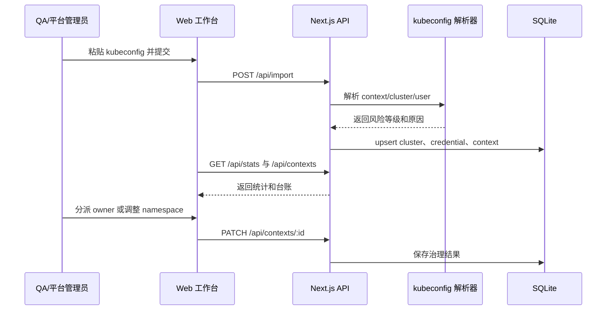
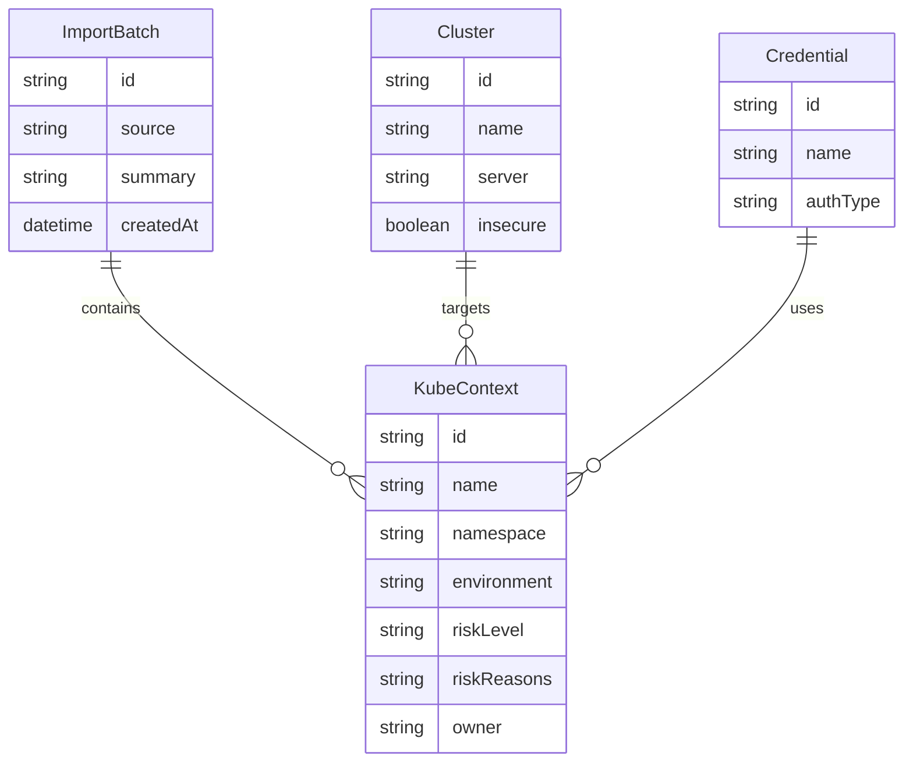
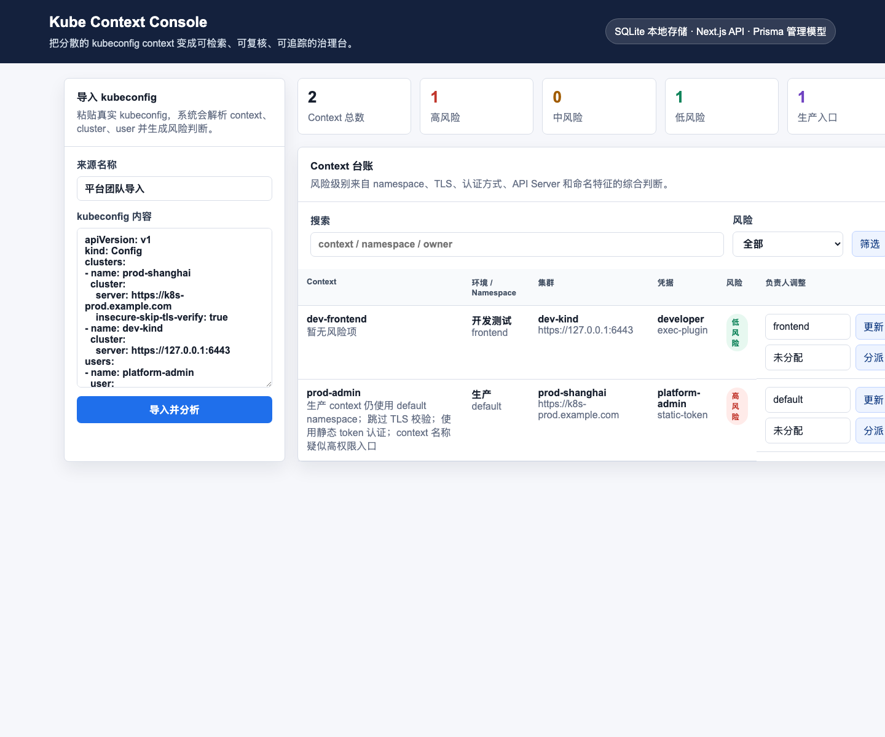

# Kube Context Console

面向平台团队的 Kubernetes context 治理台。系统把分散在 kubeconfig 里的 context、cluster、user 解析成可检索台账，并根据命名空间、TLS、认证方式、API Server 协议和命名特征识别风险，帮助团队在交接、审计和上线前快速发现高风险入口。

## 业务背景

很多团队的 kubeconfig 长期由个人维护，常见问题包括：

- 生产 context 仍指向 `default` namespace，切换时容易误操作。
- 静态 token、跳过 TLS 校验、非 HTTPS API Server 等风险无法集中发现。
- context 名称、集群地址、凭据类型分散在本地文件中，缺少负责人和复核状态。
- QA 或平台管理员无法按统一流程验收新增集群入口。

Kube Context Console 将这些信息导入 SQLite，形成一个可查询、可复核、可分派的轻量治理台。

## 核心能力

| 能力 | 说明 |
| --- | --- |
| kubeconfig 导入 | 粘贴 kubeconfig YAML，系统解析 context、cluster、user 的绑定关系 |
| 风险识别 | 识别生产 default namespace、跳过 TLS、静态 token、非 HTTPS、疑似高权限 context |
| 台账检索 | 按 context、namespace、owner、风险等级筛选 |
| 责任分派 | 在页面中更新 owner，便于平台团队跟进 |
| namespace 调整 | 记录治理后的 namespace，支撑复核流程 |
| 本地数据存储 | 使用 better-sqlite3 + SQLite，适合单团队内网治理和 QA 验收 |

## 架构图

```mermaid
flowchart LR
  A[平台管理员粘贴 kubeconfig] --> B[Next.js 页面]
  B --> C[/api/import]
  C --> D[kubeconfig 解析器]
  D --> E[风险规则引擎]
  E --> F[SQLite Repository]
  F --> G[(SQLite)]
  B --> H[/api/contexts]
  B --> I[/api/stats]
  H --> G
  I --> G
```

## 业务流程图



## 数据模型



## 页面截图

应用启动后首页即为治理工作台，左侧导入 kubeconfig，右侧展示统计卡片和 context 台账。验收截图建议保存为 `docs/images/runtime-screenshot.png`。



## 技术栈

- TypeScript
- Next.js App Router
- better-sqlite3
- SQLite
- Vitest

## 本地启动

```bash
npm install
cp .env.example .env
npm run db:seed
npm run dev
```

访问地址：

```text
http://localhost:3000
```

## 测试与构建

```bash
npm run test
npm run build
npm run verify
```

`npm run verify` 会先跑核心解析测试，再执行生产构建。核心测试覆盖：

- kubeconfig YAML 解析
- context / cluster / user 绑定
- 生产 default namespace、静态 token、跳过 TLS 等风险识别
- 不完整 context 的拒绝逻辑

## QA 验收流程

1. 执行 `npm install` 安装依赖。
2. 执行 `cp .env.example .env && npm run db:seed` 初始化数据库。
3. 执行 `npm run dev`，打开 `http://localhost:3000`。
4. 首页应展示已导入的 context 台账，并能看到高风险统计。
5. 在左侧导入框粘贴 `tests/fixtures/sample-kubeconfig.yaml` 的内容并提交。
6. 检查台账中 `prod-admin` 是否被标记为高风险，风险原因应包含跳过 TLS、静态 token、生产 default namespace。
7. 修改 `prod-admin` 的负责人或 namespace，刷新后数据应保留。
8. 执行 `npm run verify`，测试和构建均应通过。

## Docker 验收

标注交付包采用外层 Dockerfile 构建，仓库源码目录自身不放 Dockerfile。QA 在交付目录执行：

```bash
docker build -t kube-context-console .
docker run --rm -p 3000:3000 kube-context-console
```

访问：

```text
http://localhost:3000
```

## 故障排查

| 现象 | 处理方式 |
| --- | --- |
| 页面提示数据库表不存在 | 确认 `.env` 中 `DATABASE_URL` 为 `file:./dev.db`，再重启应用，表结构会自动创建 |
| 数据库文件不可写 | 检查项目目录权限，或把 `DATABASE_URL` 改成可写路径 |
| 导入失败且提示内容过短 | 确认粘贴的是完整 kubeconfig YAML |
| 页面无数据 | 执行 `npm run db:seed` 或从页面重新导入 kubeconfig |
| 构建失败且提示 native 模块缺失 | 删除 `node_modules` 后重新执行 `npm install` |

## 目录结构

```text
src/app                 Next.js 页面与 API 路由
src/components          工作台交互组件
src/lib/kubeconfig.ts   kubeconfig 解析和风险规则
src/lib/repository.ts   SQLite 数据读写
src/lib/database.ts     SQLite 连接管理
prisma/schema.prisma    数据模型说明
tests/                  核心流程测试
scripts/seed.ts         QA 验收数据导入
```
